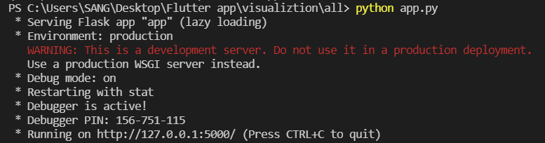
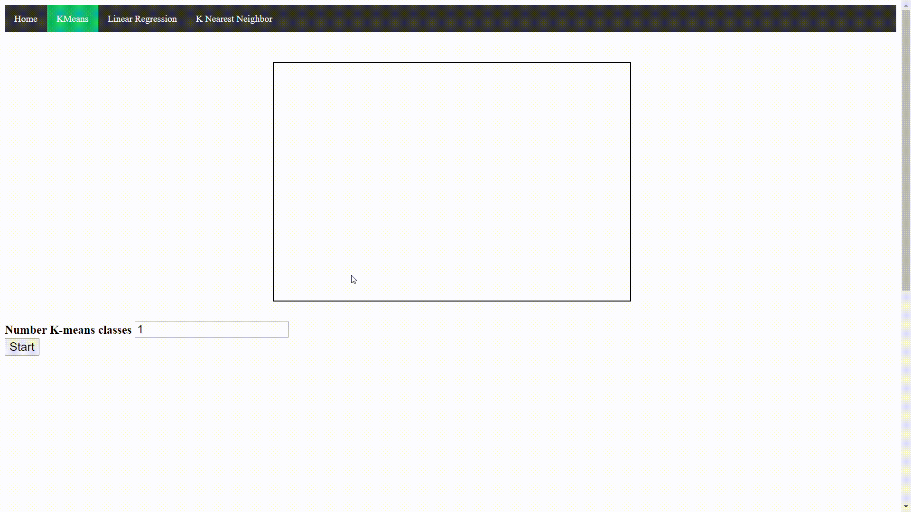
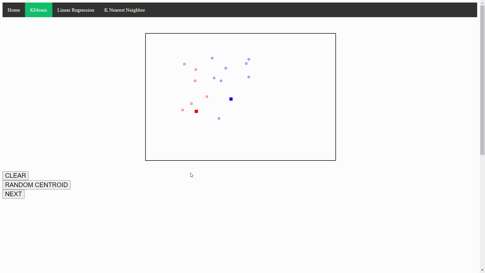
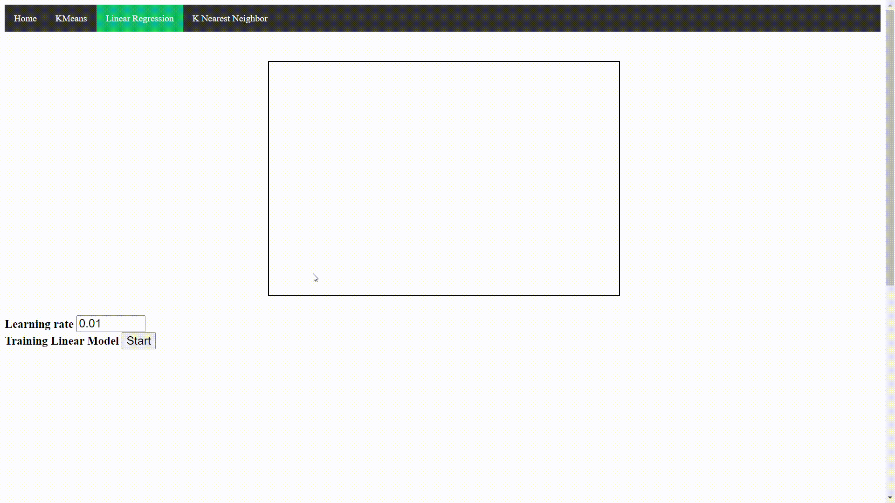
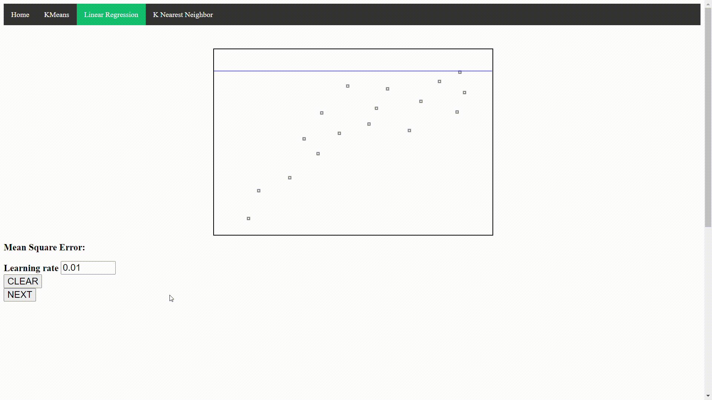
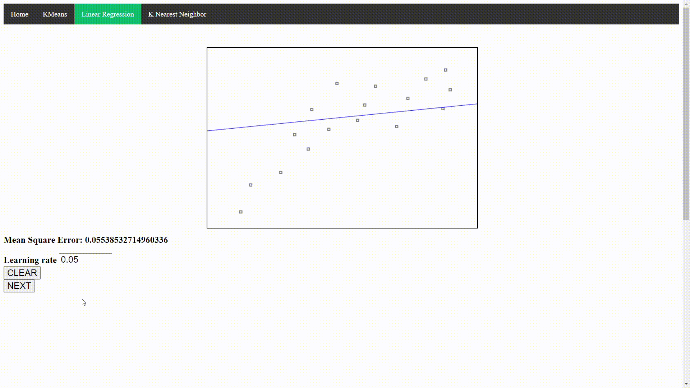
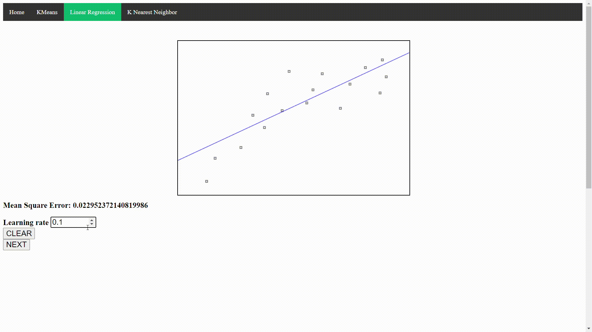
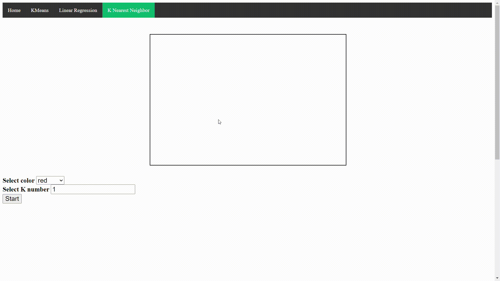
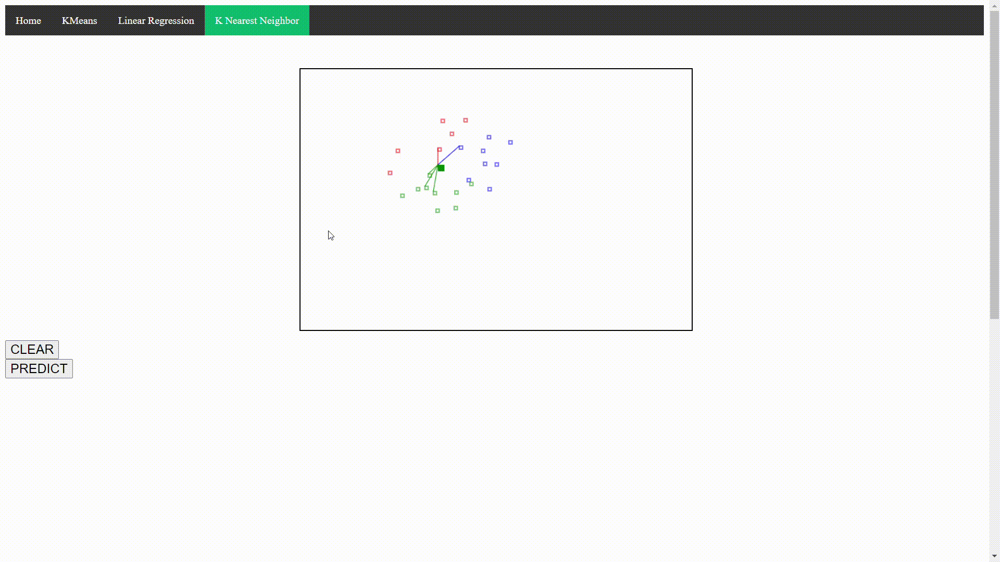

# Machine Learning algoritms visualization
## Installation and runing
- First we have to install all the required python libraries.
```
pip install -r requirements.txt
```
- Then, just run run the app.py file to enjoy the visualization.
```
python app.py
```
- Get access to the http://127.0.0.1:5000/ 
<br> <br> 

<br> <br> 
## K-means visualization
- First, we draw some points in the box and select the number of cluster **k**.<br> <br>

<br> <br>
- Then, we just click the **NEXT** to see the centroids moving.
- By clicking the **RANDOM CENTROID** button, the centroids will be randomly regenerated.<br> <br>

<br> <br>
## Linear Regression visualization
- Similarly, we draw some points in the box, you can try to draw points on a **"straight" line**. It means you are trying to make them to have a **linear correlation**.<br> <br>

<br> <br>
- After clicking the **START** button, we countinue clicking the **NEXT** button to see how the blue line changes itshelf to optimize the distances to all the points.<br> <br>

<br> <br>
- You can change the **Learning rate** so that the optimizer may optimize more quickly.<br> <br>

<br> <br>
- However, you have to be careful, the large learning rate may make it to "jump over" the minima we are trying to reach .<br> <br>

## KNN Classifier visualization
- Differently from the two aboves, when drawing points in the KNN site, we have to select the color. It means that we have to **label** them in the beginning.
- Don't forget to set the **K number**. This number, in details, indicates that there will be **k** nearest points to be taken out to decide which the label of the predicting point is. 
<br><br>

<br><br>
- In the visualization phase, we can see there are **K** lines from **K** nearest generated points to the predicting point.
- In this below example, **K** is initially set to 5. 
<br><br>

<br><br>
